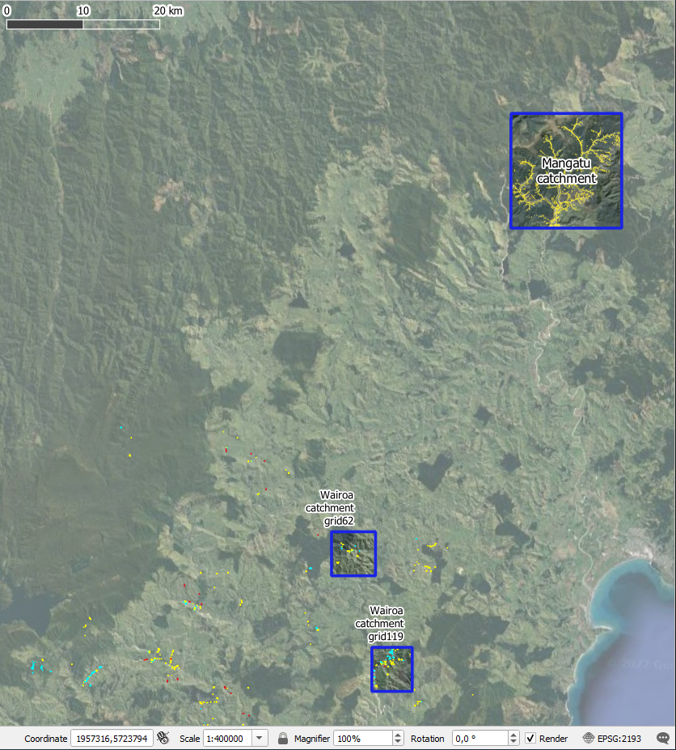
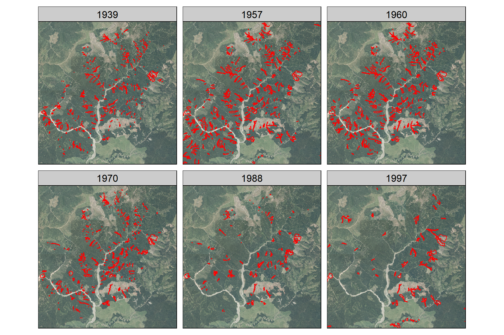
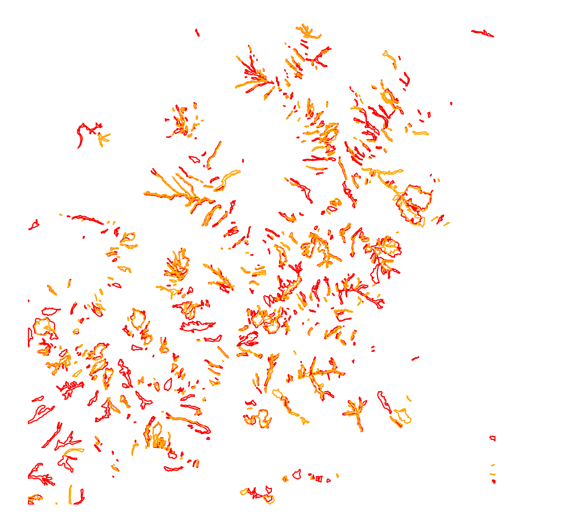
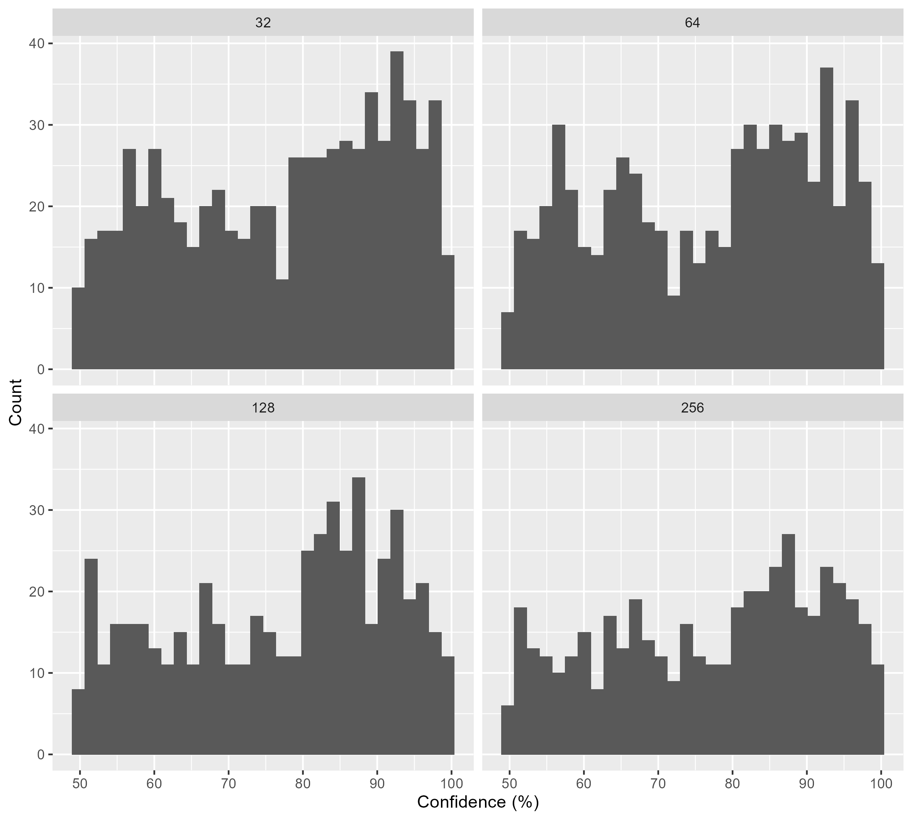
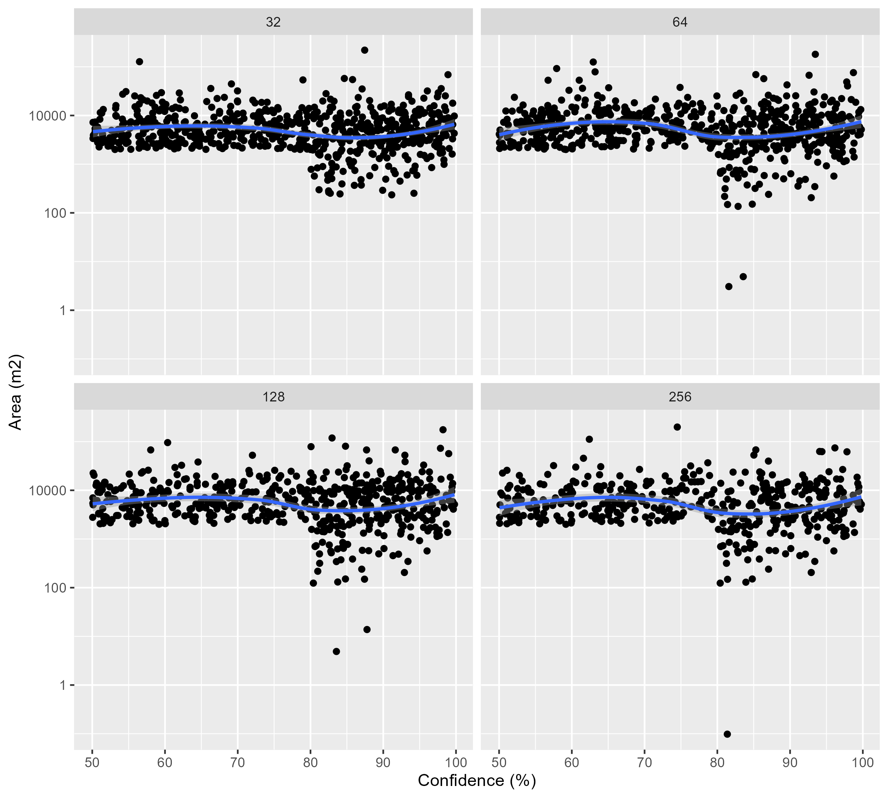
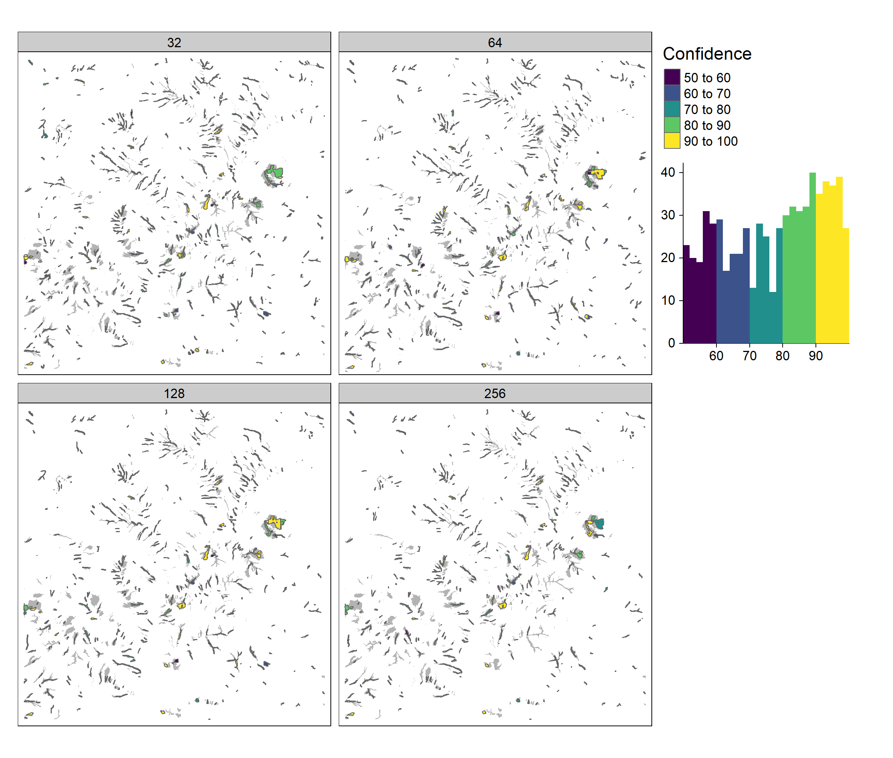
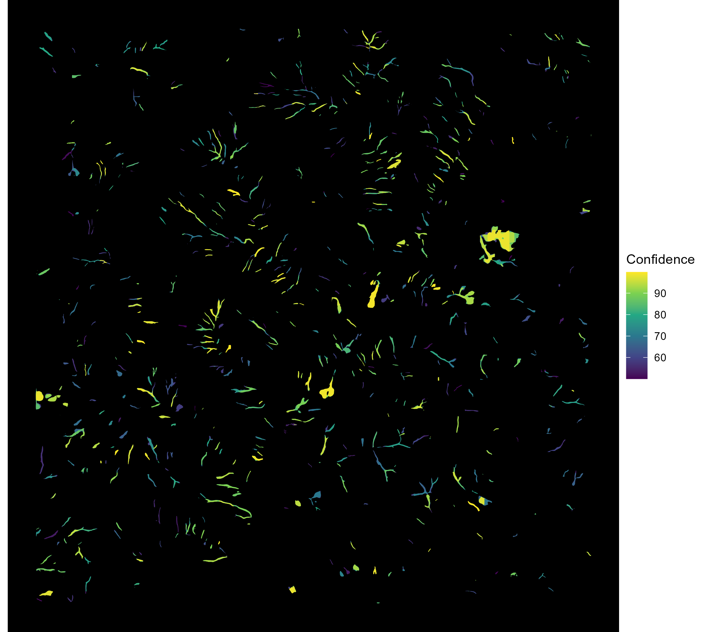
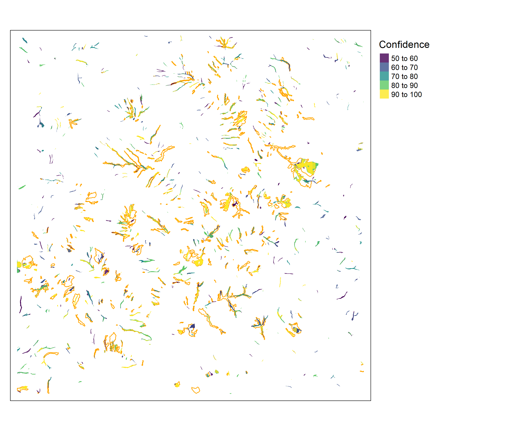
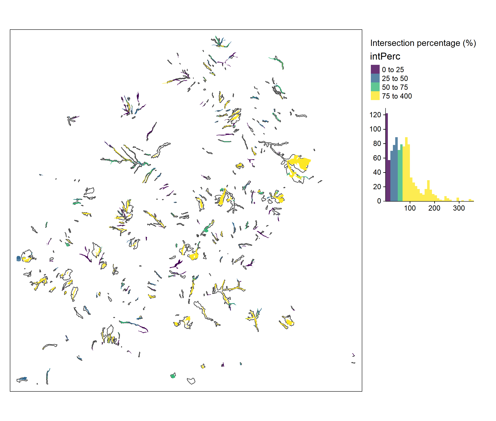

```{r setup, include=FALSE}
knitr::opts_chunk$set(echo = FALSE)
## libraries
library(DiagrammeR)
library(sf)
library(tmap)
library(stars)
```

# Motivation

Gully erosion is an indicator of land degradation, which occurs due to the removal of soil along drainage channels through surface water runoff. Given the significant impact of gullies, it is essential to develop reliable and targeted analysis methods to better understand their spatial occurrence and enable improved representation of these erosion processes in catchment sediment budget models.

The aims of the study were:

- To develop a deep learning model to automatically map gullies in the Mangatu catchment. 
- To use DEM data and its derivatives to find the best suited layers for gully detection.
- To test if reference gully data generated from historical aerial imagery can still be used as a valuable input for model training.
- To validate the model and test its transferability by inferencing gully features in the validation area in Wairoa. 

# Methodology

## Study areas

Mangatu catchment for training and testing; Wairoa for model validation (Fig. \@ref(fig:sa)).

```{r sa, out.width = "60%", fig.cap = "Study areas for analysis. The Mangatu catchment was used for model training and testing and subsets of the Wairoa catchment for validation", fig.align="center"}

```

## Data

### Reference data

The reference data consists of a combination of all gully features for 1939, 1957, 1960, 1970, 1988, 1997 from @Marden2012 and @Marden2014 (Fig. \@ref(fig:gullyref)). These data was manually delineated based on historical aerial photography. 

```{r eval = F}
gullies = st_read("../data/reference/gullies.shp")
bg = read_stars(
  "../data/gisborne-04m-rural-aerial-photos-2012-2013_mangatu.tif",
  proxy = TRUE
)
t = tm_shape(bg) +
  tm_rgb(alpha = 0.85) +
  tm_shape(gullies) +
  tm_polygons(border.col = "red", alpha = 0, width = 2) +
  tm_facets("year", free.coords = FALSE)
tmap_save(t, filename = "gully_reference_data.png",
          dpi = 300, width = 15, height = 10, units = "cm")
```

```{r gullyref, out.width = "80%", fig.cap = "Gully reference data for the Mangatu catchment. From @Marden2012 and @Marden2014. Background: Aerial imagery collected between 2012 and 2013.", fig.align="center"}

```

The original data delivered by MWLR had a problem with co-registration, where polygons were not matching their correct geographical locations. To correct this, we used an affine transformation, [see more details here](https://loreabad6.github.io/Gullies/pre-processing/coregistration_approach.html).

The data was split into training and testing with a 70:30 ratio, stratified by year. 
To use it as reference data, the polygons were merged and dissolved. 

```{r, eval = FALSE, echo = TRUE}
library(sf)
library(tidyverse)
library(here)
g = read_sf(here("data/reference/gullies.shp"))
set.seed(7319)
g = g %>% mutate(id = row_number())
train = g %>% 
  group_by(year) %>% 
  slice_sample(prop = 0.7) %>% 
  ungroup() 
test = g %>% 
  as_tibble() %>% 
  anti_join(train, by = 'id') %>% 
  st_as_sf() %>% 
  select(-id)
train = train %>% 
  select(-id)

write_sf(
  train,
  dsn = here("data/reference/gullies_train.shp"),
  delete_layer = TRUE
)
write_sf(
  test,
  dsn = here("data/reference/gullies_test.shp"),
  delete_layer = TRUE
)

train %>% 
  st_union() %>% 
  st_cast("POLYGON") %>% 
  st_sf(class = 1) %>% 
  write_sf(
    dsn = here("data/reference/gullies_train_union.shp"),
    delete_layer = TRUE
  )

test %>% 
  st_union() %>% 
  st_cast("POLYGON") %>% 
  st_sf(class = 1) %>% 
  write_sf(
    dsn = here("data/reference/gullies_test_union.shp"),
    delete_layer = TRUE
  )
```


### LiDAR DEM data

The LiDAR DEM data corresponds to the year 2019 with a spatial resolution of 1 m. We used SAGA to calculate 12 terrain derivatives based on the LiDAR DEM, which included: 

1. Slope 
1. Aspect
1. Profile curvature
1. Plan curvature
1. Hillshade
1. Slope length and steepness (LS) Factor
1. Mass Balance Index
1. Stream Power Index
1. Texture
1. Terrain ruggedness index
1. Terrain wetness index
1. Vertical distance to channel network

## Deep Learning Model

We tested a region-based convolutional neural network (Mask-RCNN) deep learning approach for object detection to map gully features. Mask-RCNN is a model for image segmentation, developed on top of Faster R-CNN [@He2017a]. [See more information on how Mask-RCNN works here](https://github.com/Esri/arcgis-python-api/blob/master/guide/14-deep-learning/How_MaskRCNN_works.ipynb). 

The deep learning was performed woth a RGB combination of the 12 terrain derivatives.
Latest tests were acceptable with: 'lsfct','shade','tridx'.
Labelled chips for training data were generated with the reference gully features.

The main workflow took place in ArcGIS Pro 2.9.2. 
The workflow in figure \@ref(fig:workflow) is recommended. 
The operating system used was Microsoft Windows 10 Enterprise, with processor characteristics Intel(R) Xeon(R) CPU E5-1650 v4 @ 3.60GHz, 6 cores and 12 logical processors, 64GB of installed RAM and NVIDIA GeForce GTX 1070  GPU with 8GB of dedicated memory and 6.1 compute capability.

```{r workflow, fig.align='center', fig.cap = "Deep Learning workflow for object detection in ArcGIS Pro"}
grViz(
"digraph {
  graph [layout = dot, rankdir = LR]
  
  node [shape = round, fontname = Helvetica, fillcolor = lightblue, style = filled]        
  rec1 [label = 'Export Training Data for Deep Learning']
  rec2 [label = 'Train Deep Learning Model']
  rec3 [label = 'Detect Objects Using Deep Learning']
  
  # edge definitions with the node IDs
  rec1 -> rec2 -> rec3 
  }", 
  width = 800, height = 80
)
```

These steps can be applied using the GUI or with the ArcPy Python modules for ArcGIS.

**Using the ArcPy and learn modules, we established the workflow below within a Jupyter notebook and a ArcGIS Pro Project.**

See [documentation of the Python API here](https://developers.arcgis.com/python/api-reference/arcgis.learn.toc).

0. Pre-process data:

```{python, eval = F, echo = T}
# Import system modules and check out ArcGIS Image Analyst extension license
import arcpy
arcpy.CheckOutExtension("ImageAnalyst")
from arcpy.ia import *
from arcpy import env
data_dir = r'data'
env.workspace = data_dir

# Composite bands
arcpy.CompositeBands_management(
    "mangatu_cplan.tif;mangatu_cprof.tif;mangatu_ddgrd.tif;mangatu_lsfct.tif;mangatu_mbidx.tif;mangatu_shade.tif;mangatu_slope.tif;mangatu_spidx.tif;mangatu_textu.tif;mangatu_tridx.tif;mangatu_twidx.tif;mangatu_vdcnw.tif",
    "terrain.tif"
)

# Rename bands
terrain = r'data\terrain.tif'
terrain_raster = Raster(terrain, True)

terrain_raster.renameBand(1, 'cplan')
terrain_raster.renameBand(2, 'cprof')
terrain_raster.renameBand(3, 'ddgrd')
terrain_raster.renameBand(4, 'lsfct')
terrain_raster.renameBand(5, 'mbidx')
terrain_raster.renameBand(6, 'shade')
terrain_raster.renameBand(7, 'slope')
terrain_raster.renameBand(8, 'spidx')
terrain_raster.renameBand(9, 'textu')
terrain_raster.renameBand(10, 'tridx')
terrain_raster.renameBand(11, 'twidx')
terrain_raster.renameBand(12, 'vdcnw')
terrain_raster.getRasterBands()
```


1. Export training data:

```{python, eval = F, echo = T}
# Define variables
terrain = r'data\terrain.tif'
terrain_raster = Raster(terrain, True)
gullies = r'data\gullies_train.shp'
out_chips = r'work\terrain_3lay'

# Select bands
terrain_sel = ExtractBand(terrain_raster, band_names=['lsfct','shade','tridx'])

# Execute ArcPy tool for data export
ExportTrainingDataForDeepLearning(
    terrain_sel, out_chips, gullies, 
    "TIFF", 1024, 1024, 512, 512,
    "ONLY_TILES_WITH_FEATURES", "RCNN_Masks", 0, "",
    0, None, 0, "MAP_SPACE", "PROCESS_AS_MOSAICKED_IMAGE",
    "NO_BLACKEN", "FIXED_SIZE"
)

# Prepare data 
from arcgis.learn import prepare_data
data = prepare_data(
    out_chips, 
    batch_size=4, chip_size=512,
    imagery_type='ms' #multispectral
)
data.show_batch(rgb_bands=[0,1,2])
```

2. Model training:

```{python, eval = F, echo = T}
# Define model architecture
from arcgis.learn import MaskRCNN
maskrcnn = MaskRCNN(
    data, backbone='resnet50', pointrend=True
)

# Find efficient learning rate
maskrcnn.lr_find() # result goes into next command

# Fit the model
maskrcnn.fit(epochs=20, lr=maskrcnn.lr_find())

# Unfreeze the model 
maskrcnn.unfreeze()

# Plot losses
maskrcnn.plot_losses()

# Show results
maskrcnn.show_results(rows=3)

# Save model
maskrcnn.save('gully_model_lsfctshadetridx_20ep')
```

3. Detect objects:

```{python, eval = F, echo = T}
arcpy.env.processorType = "GPU"
# Set local variables
terrain_sel = ExtractBand(terrain, band_names=['cplan','lsfct','slope','spidx','tridx','twidx'])
in_raster = terrain_sel
out_detected_objects = "work/terrain_3lay/results/gully_lsfctshadetridx_20ep.shp"
in_model_definition = "work/terrain_3lay/models/gully_model_lsfctshadetridx_20ep/gully_model_lsfctshadetridx_20ep.emd"
model_arguments = "padding 256;threshold 0.5;batch_size 4"
run_nms = "NO_NMS"
confidence_score_field = "Confidence"
class_value_field = "Class"
max_overlap_ratio = 0
processing_mode = "PROCESS_AS_MOSAICKED_IMAGE"

# Check out the ArcGIS Image Analyst extension license
arcpy.CheckOutExtension("ImageAnalyst")

# Execute 
DetectObjectsUsingDeepLearning( in_raster, out_detected_objects, 
   in_model_definition, model_arguments, run_nms, confidence_score_field, 
   class_value_field, max_overlap_ratio, processing_mode)
```

For this step we tested several padding sizes (256, 128, 64, 32). 
Every run of the tool resulted in slightly different results.

## Validation

To validate the deep learning model, gully features from the Wairoa catchment, northern Hawke's Bay would be ideally used. This data is from the SedNetNZ project, where erosion features including gullies, earthflows and cliffs were mapped on a 5x5 km grid. The features were mapped based on aerial imagery. For the Northern Wairoa catchment, the Gisborne 2017-19 regional aerial imagery with 0.3 m spatial resolution and for the Southern Wairoa catchment, the HBRC 2019-20 regional aerial imagery with 0.3 m spatial resolution were used.

The validation would take place by selecting the mapped gully features from the dataset, and using them as a base for comparison with the results of the deep learning model applied for this area. Measures such as Intersection over Union (IoU) and accuracy can be then computed to evaluate the performance of the model using an unbiased and completely new dataset.

### Current status

For now, work has been delayed due to the delivery of LiDAR for the Hawke's Bay region (expected now in July 2022). However, some other LiDAR tiles were available covering two grid cells (62 and 119) from the erosion feature mapping. An initial exploration of these tiles are shown in figure \@ref(fig:valfeat).

<details>

<summary>

Click to expand!

</summary>

```{r valfeat, fig.cap = "Selected examples within the Wairoa catchment for erosion features. Grids 62 and 119.", fig.align="center", fig.show="hold", out.width="100%"}
knitr::include_graphics("../data_wairoa/zoom/zoom1.png")
knitr::include_graphics("../data_wairoa/zoom/zoom2.png")
knitr::include_graphics("../data_wairoa/zoom/zoom3.png")
knitr::include_graphics("../data_wairoa/zoom/zoom4.png")
knitr::include_graphics("../data_wairoa/zoom/zoom5.png")
knitr::include_graphics("../data_wairoa/zoom/zoom6.png")
knitr::include_graphics("../data_wairoa/zoom/zoom7.png")
knitr::include_graphics("../data_wairoa/zoom/zoom8.png")
```

</details>

From this initial exploration, several points regarding the data emerged:

1.  **Data completeness:** There are several locations within these two grids that at the (non-expert) naked-eye, would look like erosion features however they are not mapped. The layers were called "initial mapping" so the question on whether an updated version of this mapping is available arises.

2.  **Feature characteristics:** Some of the features mapped as gullies and cliffs are very similar to each other. We wonder if there was any criteria or rules followed to decide to classify the features among the presented categories.

3.  **Feature delineation:** It might be that the background data we have used to look into these features is not the same as the one used for mapping them. However, we see some discrepancies between what can be observed and the actual mapped feature. Hence, we wonder how accurate this delineation really is.

Further grid cells could be explored once the new LiDAR data is there but we believe that these issues should be clarified early enough before using this new area as a validation site. If the data is incomplete, the delineations are not accurate, and the features happen to be mixed between cliffs and gullies, then we think that 1) the deep learning model will have a hard time differentiating the gully features, and 2) any validation measures computed with these data reference data will be biased, probably presenting several "false positives" that were actually correctly mapped features. To be able to do a good validation of the model, we require an area with a 100% accurate and complete mapping of the features.

# Results

```{r, eval=F, echo=T}
## Visualize results from ArcGIS deep learning workflow:
library(sf)
library(stars)
library(tmap)
library(here)
library(tidyverse)
library(patchwork)

ref_dir = here("data/reference/")
output_dir = here("deep_learning/DetectedObjects_update/output/")
output_fs = list.files(
  output_dir,
  pattern = "^lsfctshadetridx_train.*shp$", 
  full.names = TRUE
)
output_name = list.files(
  output_dir,
  pattern = "^lsfctshadetridx_train.*shp$", 
  full.names = FALSE
) %>% str_extract("pad[0-9]+") %>% 
  str_extract("[0-9]+")

read_id = function(x, name) {
  read_sf(x) %>% 
    mutate(pad = as.numeric(name))
}
detectedObjects = map2(output_fs, output_name, read_id) %>% 
  bind_rows() %>% 
  arrange(Confidence)

train = here(ref_dir, "gullies_train_union.shp") %>% 
  read_sf() %>% 
  st_transform(st_crs(detectedObjects))
test = here(ref_dir, "gullies_test_union.shp") %>% 
  read_sf() %>% 
  st_transform(st_crs(detectedObjects))

detectedObjects = detectedObjects %>% 
  mutate(area = as.numeric(st_area(geometry)))

detectedObjectsFiltered = detectedObjects %>% 
  filter(area > 2000 | Confidence > 80)

padcount = ggplot(detectedObjectsFiltered) +
  geom_histogram(aes(Confidence)) +
  facet_wrap(~pad) +
  labs(y = "Count", x = "Confidence (%)")

padarea = ggplot(detectedObjectsFiltered) +
  aes(Confidence, area) +
  geom_point() +
  geom_smooth(method = "loess") +
  scale_y_continuous(trans = "log10") +
  facet_wrap(~pad) +
  labs(y = "Area (m2)", x = "Confidence (%)")

ggsave(padcount, filename = 'pad_count_conf.png',
       width = 20, height = 18, units = 'cm', dpi = 300)
ggsave(padarea, filename = 'pad_area_conf.png',
       width = 20, height = 18, units = 'cm', dpi = 300)

padconfmap = tm_shape(train) +
  tm_fill(col = "grey70") +
  tm_shape(detectedObjectsFiltered) +
  tm_polygons(
    col = "Confidence", palette = "viridis",
    legend.hist = TRUE
  ) +
  tm_facets(by = "pad", ncol = 2) +
  tm_layout(
    legend.hist.width = 1,
    legend.outside.position = "right",
    legend.outside.size = 0.25
  )

tmap_save(padconfmap, filename = 'pad_conf_map.png',
       width = 20, height = 17, units = 'cm', dpi = 300)

dist = ggplot(detectedObjectsFiltered) +
  geom_sf(aes(fill = Confidence), col = NA) +
  scale_fill_viridis_c() +
  theme_void() +
  theme(panel.background = element_rect(fill = "black")) 

ref = ggplot() +
  geom_sf(data = train, col = 'red', fill = NA) +
  geom_sf(data = test, col = 'orange', fill = NA) +
  theme_void() 
dims = get_dim(dist)
ref_aligned = set_dim(ref, dims)

ggsave(dist, filename = 'distribution.png',
       width = 20, height = 18, units = 'cm', dpi = 300)
ggsave(ref_aligned, filename = 'reference.png',
       width = 20, height = 18, units = 'cm', dpi = 300)

# ggplot(detectedObjectsFiltered) +
#   geom_violin(aes(y = as.numeric(area)*0.0001, x = as.factor(pad))) +
#   labs(y = "Area (ha)", x = "Padding size", title = "Area of detected objects by padding size")
```

The reference gully features were split into training and testing (Fig. \@ref(fig:resref)). 
The deep learning model trained for gully detection was applied to the same Mangatu area to detect gully features. 

```{r resref, out.width = "70%", fig.cap = "Reference gully features split into training (red) and testing (orange).", fig.align="center"}

```

Different padding sizes were applied during object detection. We filtered the results to those detected gully features with an area larger than 0.2 ha or with a detection confidence higher than 80%.

When looking at the padding sizes individually we can see that the padding number does not seem to result in higher confidence (Fig. \@ref(fig:padconf)). The same for the feature area, larger features do not seem to have a larger confidence, and their behavior is equal among image padding. 

```{r padconf, out.width = "70%", fig.cap = "Detection confidence feature count facetted by padding size.", fig.align="center"}

```

```{r padconfarea, out.width = "70%", fig.cap = "Detection confidence feature area facetted by padding size.", fig.align="center"}

```

A final look at the results per padding and their geographical distribution (Fig. \@ref(fig:padconfmap)).

```{r padconfmap, out.width = "70%", fig.cap = "Gully features detection confidence facetted by padding size.", fig.align="center"}

```

Given this homogeneity among the detected features, the results were combined as shown in Fig. \@ref(fig:results). 

```{r results, out.width = "70%", fig.cap = "Resulting gully features combined from all padding sizes (32, 64, 128, 256) and filled by their detection confidence.", fig.align="center"}

```

## Accuracy assessment

Using the test dataset, we can examine how many of the detected features overlap with the reference gullies that were not used for training (Fig. \@ref(fig:testoverlap). A quick analysis of the intersecting area between the test features and detected gullies can be observed in (Fig. \@ref(fig:testint).

```{r, eval = F, echo = T}
# detectedObjectsFilteredInt = detectedObjectsFiltered %>% 
#   rowwise() %>% 
#   mutate(
#     areaInt = st_intersection(geometry, test$geometry) %>%
#       st_area() %>% sum()
#   )
# 
# save(detectedObjectsFilteredInt, file = "backup_validation_gullies.RData")
load(file = "backup_validation_gullies.RData")
detectedObjectsFilteredInt

testoverlap = tm_shape(test) +
  tm_borders(col = "orange") +
  tm_shape(detectedObjectsFilteredInt) +
  tm_polygons(
    col = "Confidence", palette = "viridis",
    border.alpha = 0, alpha = 0.8
  ) +
  tm_layout(
    legend.outside = TRUE,
    legend.outside.position = "right",
    legend.outside.size = 0.25
  )

tmap_save(testoverlap, filename = 'acc_test_overlap.png',
       width = 20, height = 17, units = 'cm', dpi = 300)

t = detectedObjectsFilteredInt %>% 
  mutate(intPerc = as.numeric(areaInt)/area*100)

tfilt = t %>% 
  filter(intPerc > 0) 
  
testint = tm_shape(test) +
  tm_borders(col = "grey30") +
  tm_shape(tfilt) +
  tm_polygons(
    col = "intPerc", palette = "viridis",
    breaks = c(0, 25, 50, 75, 400),
    border.alpha = 0, alpha = 0.8,
    legend.hist = TRUE
  ) +
  tm_layout(
    title = "Intersection percentage (%)",
    legend.hist.width = 1,
    legend.outside = TRUE,
    legend.outside.position = "right",
    legend.outside.size = 0.25
  )
tmap_save(testint, filename = 'acc_test_int.png',
       width = 20, height = 17, units = 'cm', dpi = 300)
```

```{r testoverlap, out.width = "70%", fig.cap = "Resulting gully features combined overlapping gully reference in test dataset", fig.align="center"}

```

```{r testint, out.width = "70%", fig.cap = "Resulting gully features and the intersecting area to gully reference in test dataset", fig.align="center"}

```

# Conclusions

The data-driven deep learning framework shows promising results regarding gully presence and absence. Validation resulted in detected gullies overlapping 60% of the reference gully area. However, a limiting factor related to the available reference data that was mapped on historical aerial photography and does not align with the LiDAR DEM.

# References
