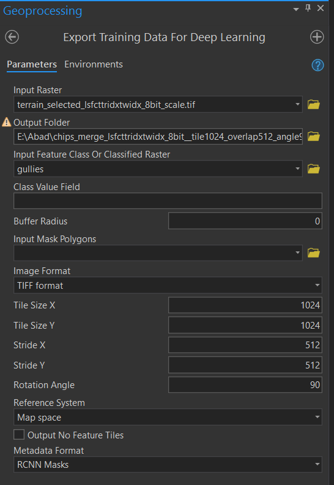
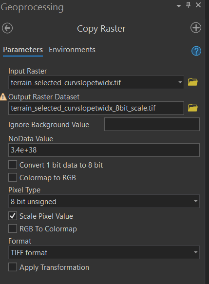
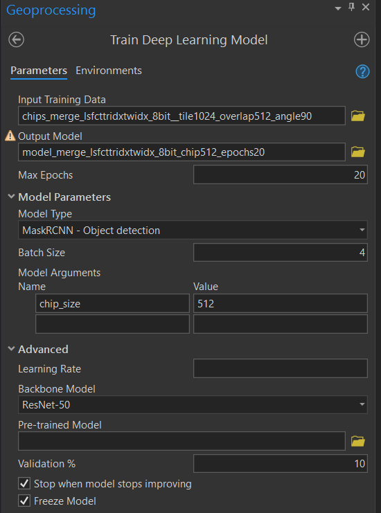
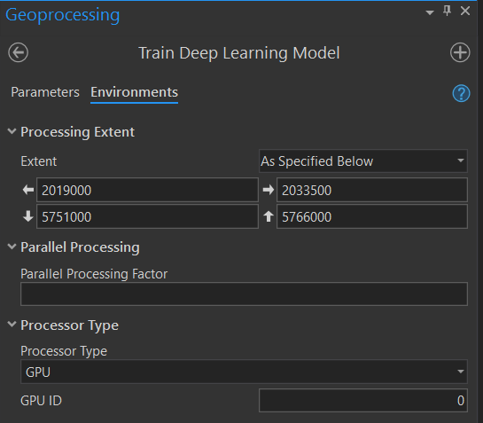
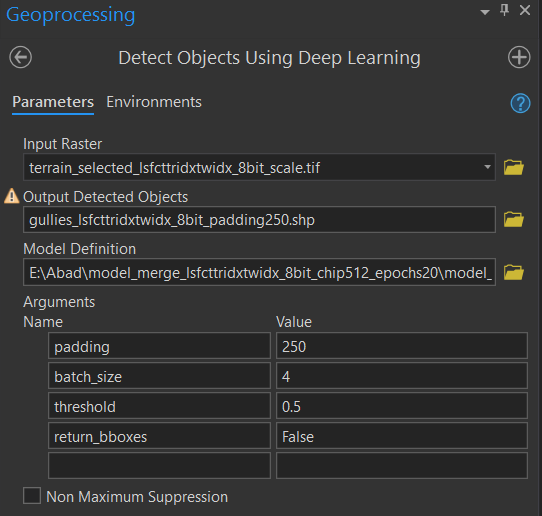
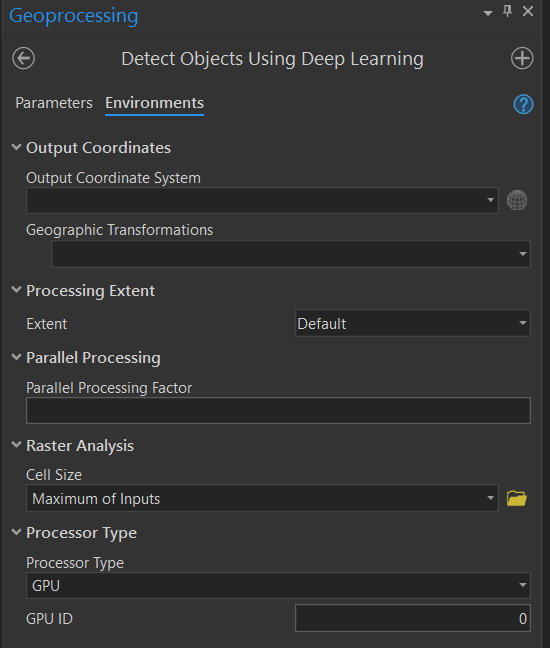

```{r setup, include = F}
knitr::opts_chunk$set(echo = F, warning = F, cache = T,
                      message = F, out.width = "100%")
```

## Getting started with Deep Learning 
In [*Deep Learning Testing*](https://loreabad6.github.io/Gullies/exploration/deepl1.html)
I did some short exploration of the ArcGIS Pro tools for Deep Learning. 
Not being familiar myself with Deep Learning techniques before going into
these tools, I did some small tests to understand how to set-up a Deep 
Learning workflow, from installation to model training and object detection.
I will first summarise here these steps, for documentation and further
"reproducibility".

### Set-up ESRI for Deep Learning
First of all, some specifications of the software I used to run the
Deep Learning tools:

- ArcGIS Pro 2.7.2 with an Advance License
- Processor: Intel(R) Xeon(R) CPU E5-1650 v4 @ 3.60GHz
- Installed RAM: 64GB
- GPU: NVIDIA GeForce GTX 1070

According to the [ESRI Deep Learning Frameworks](https://github.com/Esri/deep-learning-frameworks)
It is possible to download an installer that will take care of including
all the deep learning packages into the Python environment in ArcGIS Pro. 
However, this did not work properly, so I had to follow the instructions
on [their guide](https://github.com/Esri/deep-learning-frameworks/blob/master/install-deep-learning-frameworks-manually-2-7.pdf)
to clone the default environment for ArcGIS projects into a new 
`deeplearning` environment, and then install the libraries separately.

### Workflow and pre-requisites {.tabset}
#### Workflow 
In general to detect objects with Deep Learning, one would use the following
combination of tools:

```{r fig.align='center', fig.cap = "Deep Learning workflow for object detection in ArcGIS Pro"}
library(DiagrammeR)
grViz(
"digraph {
  graph [layout = dot, rankdir = LR]
  
  node [shape = round, fontname = Helvetica, fillcolor = lightblue, style = filled]        
  rec1 [label = 'Export Training Data for Deep Learning']
  rec2 [label = 'Train Deep Learning Model']
  rec3 [label = 'Detect Objects Using Deep Learning']
  
  # edge definitions with the node IDs
  rec1 -> rec2 -> rec3 
  }", 
  width = 800, height = 80
)
```

I found some limitations for each of these steps which I included in the next
tabs. I refer to them as pre-requisites to successfully run a deep learning 
workflow in ArcGIS Pro based solely on my efforts. It might as well be that
there are other ways to do this more efficiently that I am not aware of yet. 

#### Export Training Data
This tool creates labelled chips that will be subsequently used to train models.
 

```{r fig2, eval = F}

```

<details>
 <summary>Tool screenshot</summary>

```{r fig2, eval = T, out.width = "50%", fig.align='center', fig.cap = "Export Training Data for Deep Learning Tool"}
```

</details> <br>

I decided to use Mask RCNN (details [here](https://alittlepain833.medium.com/simple-understanding-of-mask-rcnn-134b5b330e95)),
method and hence the decisions for the parameters required for this tool.
I summarize the most important parameters below. 

| **Parameter** | **Description** |
| ----| --------------- |
| Input raster | A *single* band (any type) or a *three* band (8-bit, scaled, RGB channels) raster. |
| Input feature class | Training polygons. They can be overlapping and differ in sizes. |
| Image format | What output format should the chips have? I used TIFF. |
| Tile size | How big should the tiles be? Larger tile sizes seem to avoid problems when using the subsequent tools. |
| Stride | Overlap between tiles, should be smaller than the tile size. For no overlap `tile = stride` size. |
| Metadata | Depends on the model to train. I use RCNN Masks. |
| Rotation angle | For data augmentation, rotates the chips at certain angles to create more training samples. An angle of 90 will create 4x the number of samples. |

The output consists on a `images` and a `labels` directory. 
The images are basically cropped subsets from the original input raster. 
The labels are "masks" that should ideally have a value of `1` when the pixel
is overlayed by a training polygon or `0` when it is not. During my tests I realized that 
using overlapping training polygons can result in strange labels, where there are values 
outside of the `0-1` range generated. Users have [reported this issue on the ESRI forums without an answer so far](https://community.esri.com/t5/arcgis-pro-questions/quot-export-training-data-for-deep-learning-quot-creates/m-p/225513)
However, after some further testing I realized this is not really 
a problem when using a *three* band raster and hence did not look for a solution. 

In general this tool took between **10 and 20 minutes** to run.

**NOTE:** About the **Input raster** parameter

This can be a *single* band raster or an *three* band RGB-like raster. We aimed at
trainng our model with multiple bands (at least 15), but since we were limited by
the input data constraint, we selected a combination of three bands from the terrain
derivatives. Next, we had to convert this multiband raster into an 8-BIT-Unsigned scaled raster
to be able to run the **Training** tool. This was done with the *Copy Raster* tool in ArcGIS.


```{r fig3, eval = F}

```

<details>
 <summary>Tool screenshot</summary>

```{r fig3, eval = T, out.width = "50%", fig.align='center', fig.cap = "Copy Raster Tool"}
```

</details> <br>

#### Train Model
This tool is used to train the deep learning model.


```{r fig4, eval = F}


```

<details>
 <summary>Tool screenshot</summary>

```{r fig4, eval = T, fig.show="hold", out.width = "50%", fig.align='center', fig.cap = "Train Deep Learning Model Tool"}
```

</details> <br>

Adding a chip size larger than 512 or a batch size larger than 4 resulted in
the error *CUDA out of memory*, i.e. the GPU installed was not enough.

In general training the deep learning models took between **10 and 12 hours**. 

#### Detect Objects
Finally, this tool was used to detect the objects using the deep learning models
previously trained.


```{r fig5, eval = F}


```

<details>
 <summary>Tool screenshot</summary>

```{r fig5, eval = T, fig.show="hold", out.width = "50%", fig.align='center', fig.cap = "Detect Objects using Deep Learning Tool"}
```

</details> <br>


```{r fig6, eval = T, fig.show="hold", out.width = "50%", fig.align='center', fig.cap = "Ellapsed times vs Padding size"}
library(ggplot2)
library(dplyr)
processing = data.frame(
  padding = c(250, 200, 128, 64, 32, 16, 4, 0),
  elapsed_time = c(
    83*3600 + 53*60 + 23,
    58*60 + 55,
    11*60 + 58,
    05*60 + 31,
    03*60 + 49,
    03*60 + 26,
    03*60 + 07,
    03*60 + 24
  ),
  zoom = c(F, rep(TRUE, 7))
)
ggplot(processing) +
  aes(x = padding, y = elapsed_time) +
  geom_smooth(formula = "y ~ x", method = "loess", se = FALSE, color = "grey30") +
  geom_point(size = 4, color = "orange") +
  labs(
    x = "Padding Size", 
    y = "", 
    title = "Elapsed time according to padding size"
  ) + scale_y_time()

ggplot(filter(processing, zoom)) +
  aes(x = padding, y = elapsed_time) +
  geom_smooth(formula = "y ~ x", method = "loess", se = FALSE, color = "grey30") +
  geom_point(size = 4, color = "orange") +
  labs(
    x = "Padding Size", 
    y = "", 
    title = "Zoommed for padding size below 200"
  ) +
  scale_y_time() 
```

## Methods
### Tested input data and parameters
## Results
## Limitations and outlook

1. Number of bands 

It is really important to note that the ESRI deep learning tools are limited to the 
number of bands that can be used for training. This can be a *single* band raster
or an *three* band RGB-like raster. I believe this has to do with training models 
on very-high-resolution RGB imagery, for which these deep learning methods seem to
be optimized. However, this is a big disadvantage when having multiple bands for
instance with high-resolution Sentinel-2 image, where the full potential is not
exploited. For our case study, the goal was to include several terrain derivatives
obtained from a LiDAR DEM. However, due to the tools limitations, we had to select
three bands at a time to simulate an RGB image to be used for training. 

Other tools such as eCognition or directly using Python modules seem to allow for
multiple bands as input, and this still needs to be tested. 

2. GPU constraints


```{r render, eval = F, include = F}
o = knitr::spin('exploration/deepl2.R', knit = FALSE)
rmarkdown::render(o)
```

